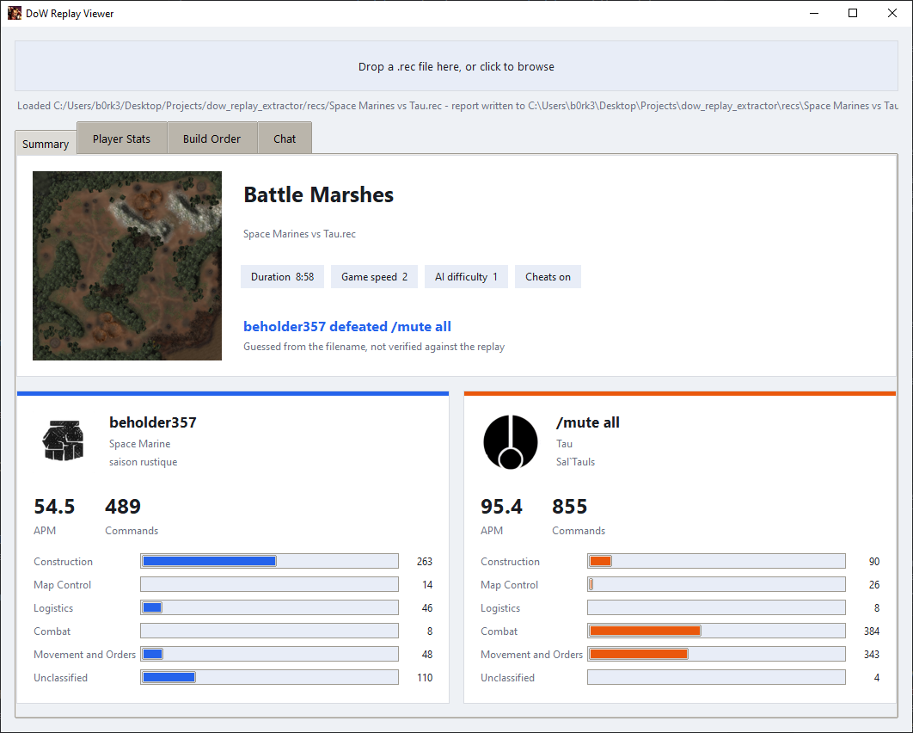

# DoW Replay Viewer

A parser and viewer for Warhammer 40,000: Dawn of War - Definitive Edition replay files (`.rec`). Drop a replay in and get the map, lobby settings, player identities and portraits, recorded APM, a full opcode/build-order breakdown, and chat history, either as a report you can browse in the GUI or as JSON/CSV on disk.

Pure Python: the command-stream parsing is a from-scratch port of ReubenUKGB's [dowde-replay-parser](https://codeberg.org/ReubenUKGB/dowde-replay-parser) (TypeScript), so there's no Node dependency, just Python and Pillow.



## Download

Grab `DoWReplayViewer.exe` from the [Releases page](../../releases), or from `dist/` if you've built it yourself. No Python needed, it's a single portable file. Drop a `.rec` onto it (or launch it and drag a file into the window) and it writes a `report.json` and `player_stats.csv` next to the replay, alongside a `report.json`/PNG portraits/banners folder.

## Running from source

```
pip install -r requirements.txt
python gui.py
```

There's also a command-line-only version if you just want the JSON/CSV without the GUI:

```
python dow_replay_report.py path/to/replay.rec
```

## Building the portable exe

```
pip install pyinstaller
pyinstaller DoWReplayViewer.spec
```

Build from the `.spec` file, not a bare `pyinstaller gui.py`, it bundles `tkinterdnd2` and the icon correctly. The result is `dist/DoWReplayViewer.exe`, fully self-contained.

## Notes

- Player attribution (which commands belong to which player) is inferred from entity-ID clustering in the command stream, and is built for 1v1 replays. Team/FFA games will still parse, but the two sides it finds won't necessarily line up with more than two real players.
- Win/loser is guessed from the filename (`<winner>-vs-<loser>` or the community `W-<x>-L-<y>` convention) when present. That's an external naming convention, not something stored in the replay, so it's always flagged as unverified.
- Map artwork is fetched from Codeberg on first use and cached in `map_cache/` next to the exe. Everything else works fully offline.

## Licence

GNU General Public License v3.0. See `LICENSE`.
